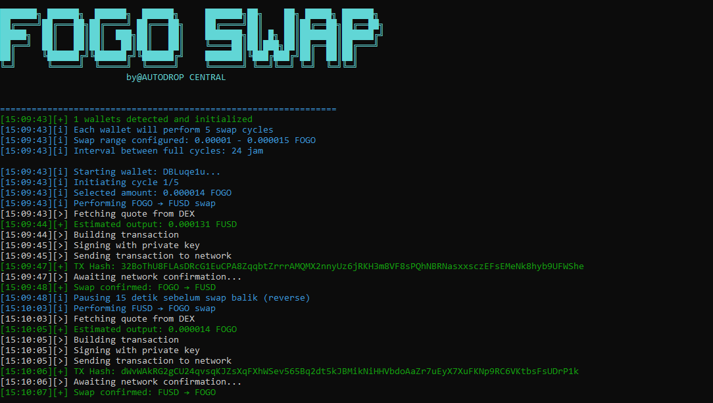

# 🔄 FOGO Auto Swap Bot

Bot otomatis untuk melakukan **swap token FOGO ↔ FUSD** di jaringan testnet **Fogo**. Bot ini berjalan dengan banyak wallet (private key) dan menjalankan siklus swap berulang-ulang secara otomatis sesuai konfigurasi.

---

## 📸 Screenshot

Berikut tampilan real-time saat bot sedang berjalan:



---

## 📌 Fitur Utama

- ✅ Swap otomatis FOGO ke FUSD dan sebaliknya
- ✅ Multi-wallet (dari file `privatekey.txt`)
- ✅ Siklus swap berulang tiap X jam (`countdownHours`)
- ✅ Jumlah swap acak (range min/max)
- ✅ Logging berwarna dan jelas di terminal
- ✅ Konfirmasi status transaksi melalui RPC
- ✅ Otomatis membuat file `config.json` dan `privatekey.txt` jika belum ada

---

## ⚙️ Cara Kerja Bot

1. **Baca konfigurasi** dari `config.json`
2. **Load semua private key** dari `privatekey.txt`
3. Untuk setiap wallet:
   - Jalankan beberapa **siklus swap**
     - Swap FOGO → FUSD
     - Tunggu delay
     - Swap FUSD → FOGO
     - Ulangi sesuai jumlah siklus
4. Setelah semua wallet selesai, **tunggu sesuai `countdownHours`**, lalu ulangi

---

## 🧾 Struktur File

- `config.json` – Pengaturan swap (API, token, delay, jumlah siklus)
- `privatekey.txt` – List private key Solana (base58), 1 per baris
- `README.md` – Penjelasan ini

---

## 📁 Contoh config.json

```json
{
  "rpcUrl": "https://testnet.fogo.io/",
  "apiUrl": "https://api.valiant.trade",
  "paymasterUrl": "https://sessions-example.fogo.io/paymaster",
  "explorerUrl": "https://explorer.fogo.io/tx/",
  "feePayer": "8HnaXmgFJbvvJxSdjeNyWwMXZb85E35NM4XNg6rxuw3w",
  "tokens": {
    "FOGO": "So11111111111111111111111111111111111111112",
    "FUSD": "fUSDNGgHkZfwckbr5RLLvRbvqvRcTLdH9hcHJiq4jry"
  },
  "cyclesPerWallet": 4,
  "swapAmount": {
    "min": 0.00002,
    "max": 0.00003
  },
  "delayBetweenSwaps": 15000,
  "delayBetweenCycles": 10000,
  "countdownHours": 24
}
````

---

## 🚀 Cara Menjalankan

1. **Install dependensi**

   ```bash
   npm install axios tweetnacl base-58
   ```

2. **Masukkan private key ke dalam `privatekey.txt`**

3. **Jalankan script**

   ```bash
   node index.js
   ```

---

## 📤 Output Terminal

```
[14:12:30][+] 3 wallets detected and initialized
[14:12:31][i] Starting wallet: 3Ugns...
[14:12:33][>] Fetching quote from DEX
[14:12:33][+] Estimated output: 0.000027 FUSD
[14:12:34][>] Building transaction
[14:12:35][+] TX Hash: 5ACJKe83.....
[14:12:36][+] Swap confirmed: FOGO → FUSD
```

---

## ⚠️ Catatan Keamanan

* 🔐 **Jangan pernah membagikan file `privatekey.txt`**
* 🔒 Pastikan Anda memahami risiko menyimpan private key dalam file plaintext
* 🌐 Belum support proxy, cocok untuk penggunaan kecil/menengah

---

## ✅ TODO (Fitur Potensial)

* [ ] Dukungan proxy per wallet
* [ ] Retry logic jika swap gagal
* [ ] Support Telegram notif/log
* [ ] Integrasi dotenv untuk keamanan key/API
* [ ] Save riwayat transaksi per wallet

---

## 🧠 Dibuat oleh

> 🧪 [@AUTODROP CENTRAL](https://t.me/AutoDropCentral) — For learning, testing, and farming purposes only


---

Jika kamu mau, saya juga bisa bantu convert jadi file `README.md` langsung dan zip bersama scriptnya. Mau sekalian?
```
